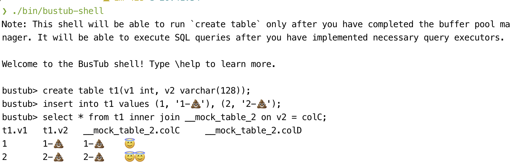

This repo is a backup of BusTub starter code, which is the teaching material for [CMU15-445/645 Spring 2023](https://15445.courses.cs.cmu.edu/spring2023/).\
Since the implementations of projects are **Disallowed To Be Public**, I've made the repo of my implementation private.\
Welcome to contact me if you have trouble implementing this version, or you may ask at the unofficial [discord channel](https://discord.gg/YF7dMCg).


My autograder score (Some total points are not given by Gradescope since I'm not CMU students):
\
\
\
\
\


Notice that [Fall 2023 version](https://15445.courses.cs.cmu.edu/fall2023/) is available, but it's not in my plan for now :sweat:.\
For further details about BusTub, see belows.
##


-----------------

[](https://github.com/cmu-db/bustub/actions/workflows/cmake.yml)

BusTub is a relational database management system built at [Carnegie Mellon University](https://db.cs.cmu.edu) for the [Introduction to Database Systems](https://15445.courses.cs.cmu.edu) (15-445/645) course. This system was developed for educational purposes and should not be used in production environments.

BusTub supports basic SQL and comes with an interactive shell. You can get it running after finishing all the course projects.



**WARNING: IF YOU ARE A STUDENT IN THE CLASS, DO NOT DIRECTLY FORK THIS REPO. DO NOT PUSH PROJECT SOLUTIONS PUBLICLY. THIS IS AN ACADEMIC INTEGRITY VIOLATION AND CAN LEAD TO GETTING YOUR DEGREE REVOKED, EVEN AFTER YOU GRADUATE.**

## Cloning this Repository

The following instructions are adapted from the Github documentation on [duplicating a repository](https://docs.github.com/en/github/creating-cloning-and-archiving-repositories/creating-a-repository-on-github/duplicating-a-repository). The procedure below walks you through creating a private BusTub repository that you can use for development.

1. Go [here](https://github.com/new) to create a new repository under your account. Pick a name (e.g. `bustub-private`) and select **Private** for the repository visibility level.
2. On your development machine, create a bare clone of the public BusTub repository:
   ```
   $ git clone --bare https://github.com/cmu-db/bustub.git bustub-public
   ```
3. Next, [mirror](https://git-scm.com/docs/git-push#Documentation/git-push.txt---mirror) the public BusTub repository to your own private BusTub repository. Suppose your GitHub name is `student` and your repository name is `bustub-private`. The procedure for mirroring the repository is then:
   ```
   $ cd bustub-public
   
   # If you pull / push over HTTPS
   $ git push https://github.com/student/bustub-private.git master

   # If you pull / push over SSH
   $ git push git@github.com:student/bustub-private.git master
   ```
   This copies everything in the public BusTub repository to your own private repository. You can now delete your local clone of the public repository:
   ```
   $ cd ..
   $ rm -rf bustub-public
   ```
4. Clone your private repository to your development machine:
   ```
   # If you pull / push over HTTPS
   $ git clone https://github.com/student/bustub-private.git

   # If you pull / push over SSH
   $ git clone git@github.com:student/bustub-private.git
   ```
5. Add the public BusTub repository as a second remote. This allows you to retrieve changes from the CMU-DB repository and merge them with your solution throughout the semester:
   ```
   $ git remote add public https://github.com/cmu-db/bustub.git
   ```
   You can verify that the remote was added with the following command:
   ```
   $ git remote -v
   origin	https://github.com/student/bustub-private.git (fetch)
   origin	https://github.com/student/bustub-private.git (push)
   public	https://github.com/cmu-db/bustub.git (fetch)
   public	https://github.com/cmu-db/bustub.git (push)
   ```
6. You can now pull in changes from the public BusTub repository as needed with:
   ```
   $ git pull public master
   ```
7. **Disable GitHub Actions** from the project settings of your private repository, otherwise you may run out of GitHub Actions quota.
   ```
   Settings > Actions > General > Actions permissions > Disable actions.
   ```

We suggest working on your projects in separate branches. If you do not understand how Git branches work, [learn how](https://git-scm.com/book/en/v2/Git-Branching-Basic-Branching-and-Merging). If you fail to do this, you might lose all your work at some point in the semester, and nobody will be able to help you.

## Build

We recommend developing BusTub on Ubuntu 20.04, Ubuntu 22.04, or macOS (M1/M2/Intel). We do not support any other environments (i.e., do not open issues or come to office hours to debug them). We do not support WSL.

### Linux / Mac (Recommended)

To ensure that you have the proper packages on your machine, run the following script to automatically install them:

```
# Linux
$ sudo build_support/packages.sh
# macOS
$ build_support/packages.sh
```

Then run the following commands to build the system:

```
$ mkdir build
$ cd build
$ cmake ..
$ make
```

If you want to compile the system in debug mode, pass in the following flag to cmake:
Debug mode:

```
$ cmake -DCMAKE_BUILD_TYPE=Debug ..
$ make -j`nproc`
```
This enables [AddressSanitizer](https://github.com/google/sanitizers) by default.

If you want to use other sanitizers,


```
$ cmake -DCMAKE_BUILD_TYPE=Debug -DBUSTUB_SANITIZER=thread ..
$ make -j`nproc`
```

### Windows (Not Guaranteed to Work)

If you are using Windows 10, you can use the Windows Subsystem for Linux (WSL) to develop, build, and test Bustub. All you need is to [Install WSL](https://docs.microsoft.com/en-us/windows/wsl/install-win10). You can just choose "Ubuntu" (no specific version) in Microsoft Store. Then, enter WSL and follow the above instructions.

If you are using CLion, it also [works with WSL](https://blog.jetbrains.com/clion/2018/01/clion-and-linux-toolchain-on-windows-are-now-friends).

### Vagrant (Not Guaranteed to Work)

First, make sure you have Vagrant and Virtualbox installed
```
$ sudo apt update
$ sudo apt install vagrant virtualbox
```

From the repository directory, run this command to create and start a Vagrant box:

```
$ vagrant up
```

This will start a Vagrant box running Ubuntu 20.02 in the background with all the packages needed. To access it, type

```
$ vagrant ssh
```

to open a shell within the box. You can find Bustub's code mounted at `/bustub` and run the commands mentioned above like normal.

### Docker (Not Guaranteed to Work)

First, make sure that you have docker installed:
```
$ sudo apt update
$ sudo apt install docker
```

From the repository directory, run these commands to create a Docker image and container:

```
$ docker build . -t bustub
$ docker create -t -i --name bustub -v $(pwd):/bustub bustub bash
```

This will create a Docker image and container. To run it, type:

```
$ docker start -a -i bustub
```

to open a shell within the box. You can find Bustub's code mounted at `/bustub` and run the commands mentioned above like normal.

## Testing

```
$ cd build
$ make check-tests
```
# bustub-2023spring
